# OFDM: many overlapping subcarriers

In this experiment, rather than sending a signal on a *single* narrowband "carrier" frequency, you will send an OFDM signal. You will ese:

- how an OFDM signal is built from many narrowband subcarriers, arranged on a grid in time and frequency
- how the subcarriers overlap in frequency but still do not interfere with one another
- how a real frequency offset between transmitter and receiver breaks that, and why this depends on the subcarrier spacing


It should take about 60-120 minutes to run this experiment, but you will need to have reserved that time in advance. This experiment uses wireless resources  - specifically, the sb5 sandbox at [COSMOS](http://cosmos-lab.org) - and you can only use wireless resources during a reservation.

To run this experiment, you will need a COSMOS account, and you will need to have joined a project. You should have already uploaded your SSH keys to your profile. (If you haven't used COSMOS before, you may want to first go through [Hello, COSMOS](https://ffund.github.io/hello-opencode/).) Finally, you must have reserved time on the sandbox, and you must run this experiment during your reserved time.

- Skip to [Results](#results)
- Skip to [Run my experiment](#run-my-experiment)


## Background

An OFDM transmitter chooses one complex symbol for each of N subcarriers, then uses an inverse FFT of size N to turn those N symbols into N time-domain samples: one OFDM symbol. It also copies the last N/4 samples to the front (the cyclic prefix). The receiver does the reverse: it takes N samples and runs an FFT, and each FFT output bin gives back the symbol on one subcarrier.

If the sample rate is f<sub>s</sub>, an OFDM symbol (without the cyclic prefix) lasts N/f<sub>s</sub>, and the subcarriers are spaced

Δf = f<sub>s</sub> / N

apart. Because each subcarrier lasts only N/f<sub>s</sub>, its spectrum is not a single line: it is a "sinc" shape with its peak at its own frequency and zeros at every multiple of Δf away from it. So the subcarriers overlap in frequency, but at the exact frequency of each subcarrier, every *other* subcarrier's spectrum is zero. That is what "orthogonal" means here, and it is why the FFT bins can separate the subcarriers.

This only works if the receiver's FFT bins line up with the transmitted subcarriers, and that depends on the transmitter and receiver agreeing exactly on the carrier frequency.

The transmitter shifts the OFDM signal up to the carrier frequency (here, 2.4 GHz) before sending it, and the receiver shifts it back down. Each radio makes its own 2.4 GHz from its own crystal oscillator, and no two oscillators run at exactly the same frequency: a typical crystal is accurate to within a few parts per million, and at 2.4 GHz, even 1 part per million is 2.4 kHz. So after the receiver shifts the signal back down, it is still off by the difference between the two radios' frequencies. This difference is the carrier frequency offset (CFO). It moves the whole received spectrum, so every subcarrier is shifted by the same number of Hz.

What matters for OFDM is how big that shift is compared with the spacing between subcarriers, so we will describe the CFO as a fraction of the subcarrier spacing:

ε = CFO / Δf

If ε is close to 0, each subcarrier is still almost exactly on its own FFT bin, and the FFT bins still land on the zeros of all the other subcarriers. As ε grows, each subcarrier slides away from its bin, and part of its power leaks into its neighbors' bins, where it interferes with them. This is called inter-carrier interference (ICI), and it is worst at ε = 0.5, when each subcarrier sits halfway between two bins. At ε = 1, each subcarrier sits exactly on its neighbor's bin: there is no leakage again, but every symbol ends up in the wrong bin. The same CFO in Hz gives a larger ε, and so more ICI, when the subcarriers are closer together.

A CFO also makes the phase of every subcarrier keep turning from one OFDM symbol to the next. A receiver deals with the CFO in two steps. First, it measures the CFO using the preamble, and shifts the received signal back by that amount ("Correct CFO", in our receiver). Then, whatever small offset is left over shows up mostly as a slow rotation that is the same on all subcarriers, and the receiver measures and undoes that rotation using the pilots ("Track common phase with pilots").

The radio pair we are using has a real CFO between them due to oscillator error (as do all radios!), but it is small (typically tens to a couple of hundred Hz at 2.4 GHz) and it drifts as the radios warm up and cool down, sometimes passing through zero. So that you can see its effect reliably, you will measure it, and then tune the transmitter a little off frequency (with its `--freq` option) to bring the total offset to a value you choose. 

Our OFDM signal uses the same layout as WiFi (802.11a). With N = 64:

- There are 64 subcarriers, numbered k = -32 to 31. Subcarrier k = 0 is at the center frequency.
- 52 of them are used: k = -26 to -1, and k = 1 to 26. The center subcarrier (k = 0) and the ones at the edges of the band are left empty.
- 4 of the used subcarriers are pilots: k = -21, -7, 7, and 21. They always carry known values, so the receiver can use them as a reference.
- The other 48 used subcarriers carry data.

With a larger N, the same layout is stretched to fit:

| N | Used subcarriers | Pilots |
|---|---|---|
| 64 | -26 to 26 (52 subcarriers) | ±7, ±21 |
| 128 | -52 to 52 (104 subcarriers) | ±14, ±42 |
| 256 | -104 to 104 (208 subcarriers) | ±28, ±84 |
| 512 | -208 to 208 (416 subcarriers) | ±56, ±168 |

The signal is sent in frames, over and over. Each frame has:

1. a preamble: 2 OFDM symbols whose values the receiver already knows. The receiver uses them to find where each frame starts, and to measure the CFO.
2. 100 data OFDM symbols, carrying random QPSK symbols.

The transmitter and receiver are both realized using GNURadio "blocks", which are composed to form a signal processing pipeline.

At the transmitter (`node1-2`):

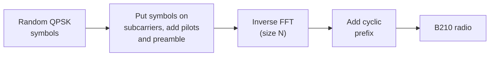
```mermaid
flowchart LR
    A["Random QPSK<br/>symbols"] --> B["Put symbols on<br/>subcarriers, add pilots<br/>and preamble"]
    B --> C["Inverse FFT<br/>(size N)"]
    C --> D["Add cyclic<br/>prefix"]
    D --> E["B210 radio"]
```

At the receiver (`node1-1`):

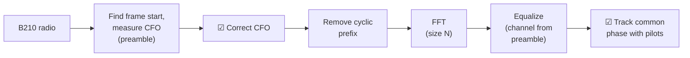
```mermaid
flowchart LR
    F["B210 radio"] --> G["Find frame start,<br/>measure CFO<br/>(preamble)"]
    G --> H["☑ Correct CFO"]
    H --> I["Remove cyclic<br/>prefix"]
    I --> J["FFT<br/>(size N)"]
    J --> K["Equalize<br/>(channel from<br/>preamble)"]
    K --> L["☑ Track common<br/>phase with pilots"]
```

(The two steps marked with a checkbox can be turned on and off.)

## Results

We will examine the signal at the receiver using an "OFDM scope" which we'll load in a web browser over an SSH tunnel. It has three tabs: "1. Time-frequency grid" shows the raw received signal, "2. Orthogonality" zooms in on one OFDM symbol and shows what the receiver's FFT does with it, and "3. Resource grid" shows every subcarrier of every OFDM symbol in one frame as a picture. 

The line at the top of the page shows the sample rate and FFT size N that the receiver is using, the measured CFO (in Hz, and as ε), and an "SNR from error", which says how close the received symbols are to what was sent: around 30 dB is very clean, and 0 dB or below means the symbols are unusable.

In the first tab, the top plot shows the current spectrum occupancy (how much power there is at each frequency), and the bottom plot is a waterfall (the progression of spectrum occupancy over time). With all the subcarriers on (1 MS/s, N = 64), the spectrum is a flat block about 830 kHz wide. The top of the block has a small ripple, with one bump every 15.6 kHz: each bump is a subcarrier, and the small dips are halfway between subcarriers. There is a deeper dip in the middle, because the subcarrier at the center frequency (k = 0) is never used.

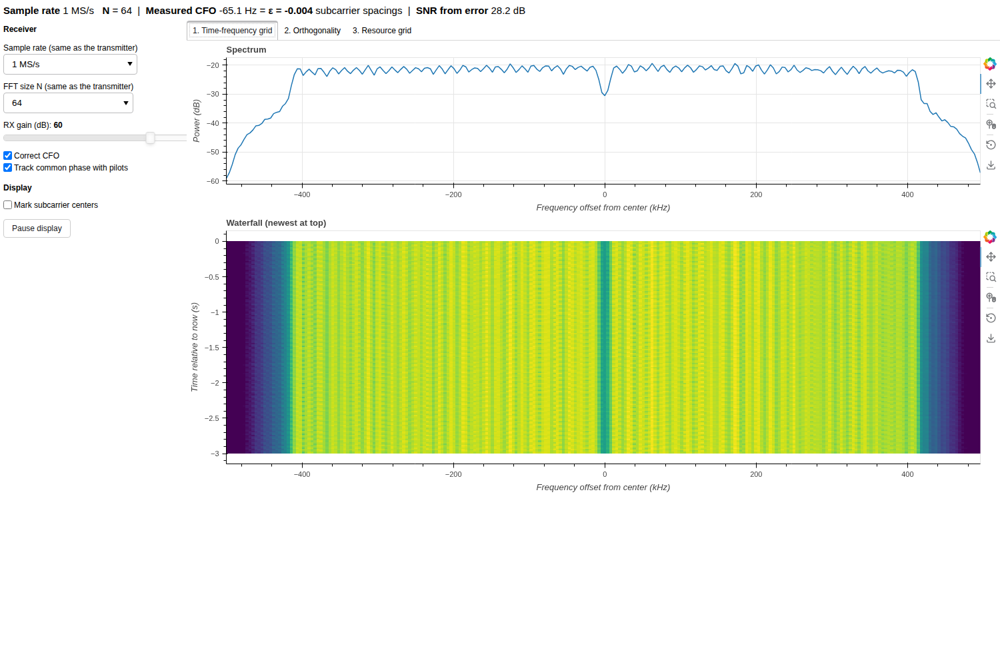

When only the two outermost subcarriers are on (`--subcarriers=-26,26`), there are just two narrow peaks, at about -406 kHz and +406 kHz. They are 52 subcarriers apart, so the subcarrier spacing is 812.5 kHz / 52 = 15.6 kHz, which is the sample rate divided by N (1 MHz / 64). The thin gray lines mark where every subcarrier would be. The low, bumpy level between the two peaks is the preamble, which always uses every subcarrier.

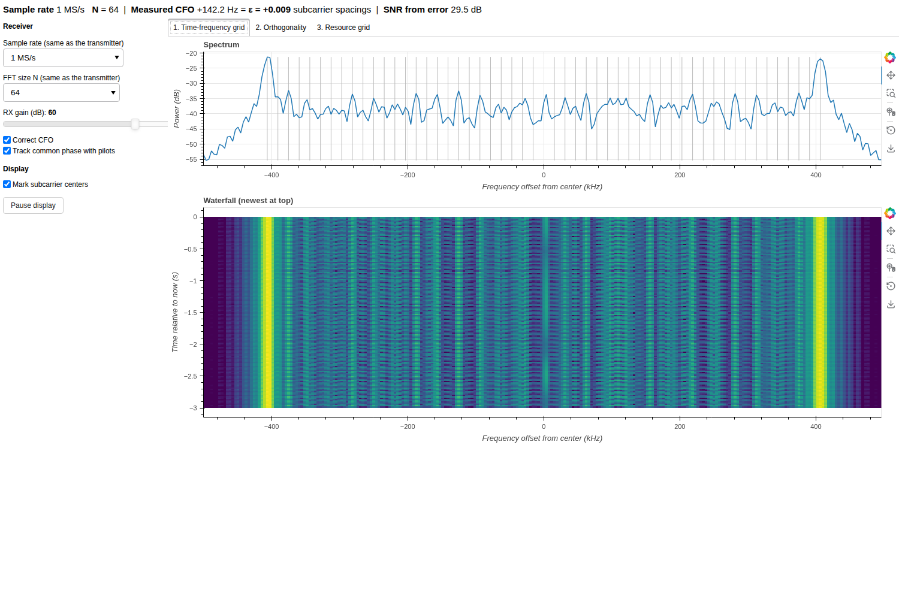

With every 4th subcarrier on (`--every 4`), there is a row of separate peaks, one on every 4th gray line. Each peak is one subcarrier.

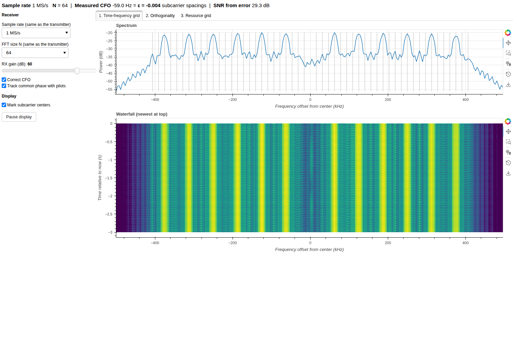

In the waterfall, frequency goes across and time goes down, so an OFDM signal is a grid: each column is a subcarrier, and each row is a moment in time. With `--text NYU`, the transmitter turns subcarriers on and off over time to draw the letters. Each pixel of a letter is a few neighboring subcarriers, left on for about 2000 OFDM symbols (about a sixth of a second). The dark bands are the gaps between repeats of the word.

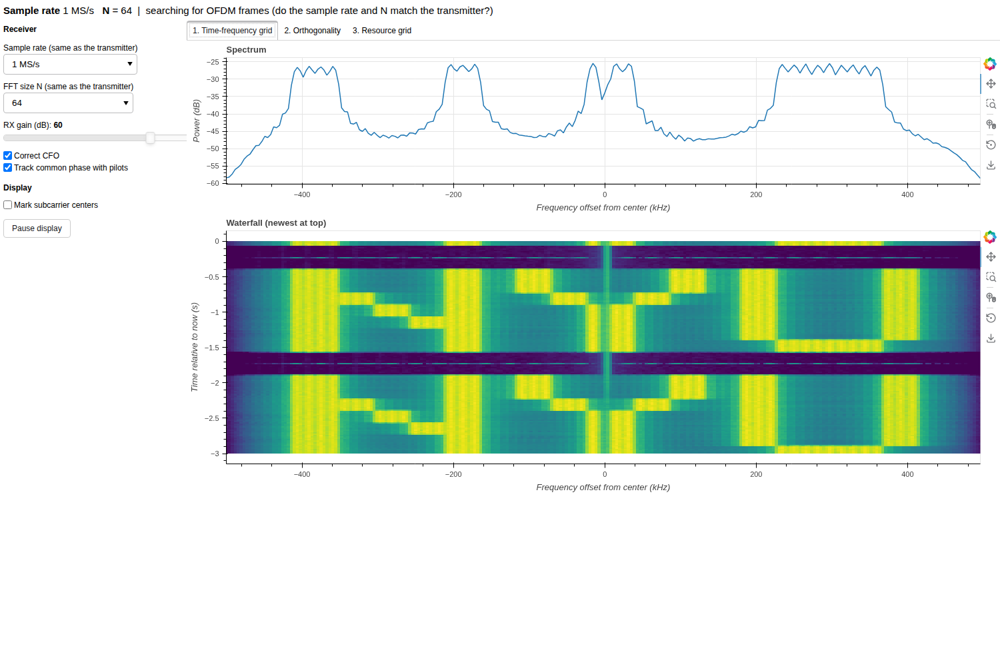

The screenshots of the second tab were taken with different transmitter settings: a lower sample rate (125 kS/s) and a larger FFT size (N = 512). With these settings, the subcarriers are only 125 kHz / 512 = 244 Hz apart, instead of 15.6 kHz. (We will see below why it helps to have the subcarriers this close together.) The top plot is the spectrum of one received OFDM symbol, drawn in fine detail:

* Its x axis is counted in subcarriers, so x = 5 is where subcarrier 5 belongs. 
* The gray line shows what was received, and the colored lines split it into one curve per subcarrier. 
* The red dots are the only values the receiver's FFT actually computes: one per subcarrier, at x = 0, 1, 2, ... 

The bottom plot shows how much power ends up at each red dot (each FFT bin), in dB, where 0 dB is the power of one whole subcarrier; the orange marks are what theory predicts. On the right is the constellation of the received data symbols: for QPSK, the dots should be in four tight clusters, on the red crosses.

With just one subcarrier on (`--subcarriers 5`), its spectrum is a "sinc": a big hump at x = 5, with small ripples on both sides. The curve crosses zero at exactly x = 4, 6, 7, 8, and so on, which is every other subcarrier's position. So the red dots at the other bins are all near zero, and in the bottom plot those bins are 30-40 dB below bin 5 (that is just noise). (The top line still shows the CFO that the receiver measured, but with "Correct CFO" checked, the receiver removes it before the FFT.)

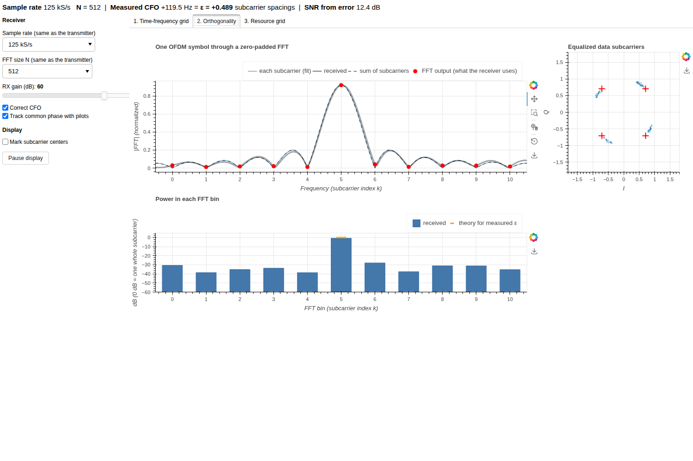

With three subcarriers on (`--subcarriers 4,5,6`), the three humps overlap a lot. But at the red dot at x = 5, the blue curve (subcarrier 4) and the green curve (subcarrier 6) both pass through zero, so the FFT output at bin 5 contains only subcarrier 5. The same is true at bins 4 and 6. This is what "orthogonal" means: the subcarriers overlap, but each FFT bin only "hears" its own subcarrier.

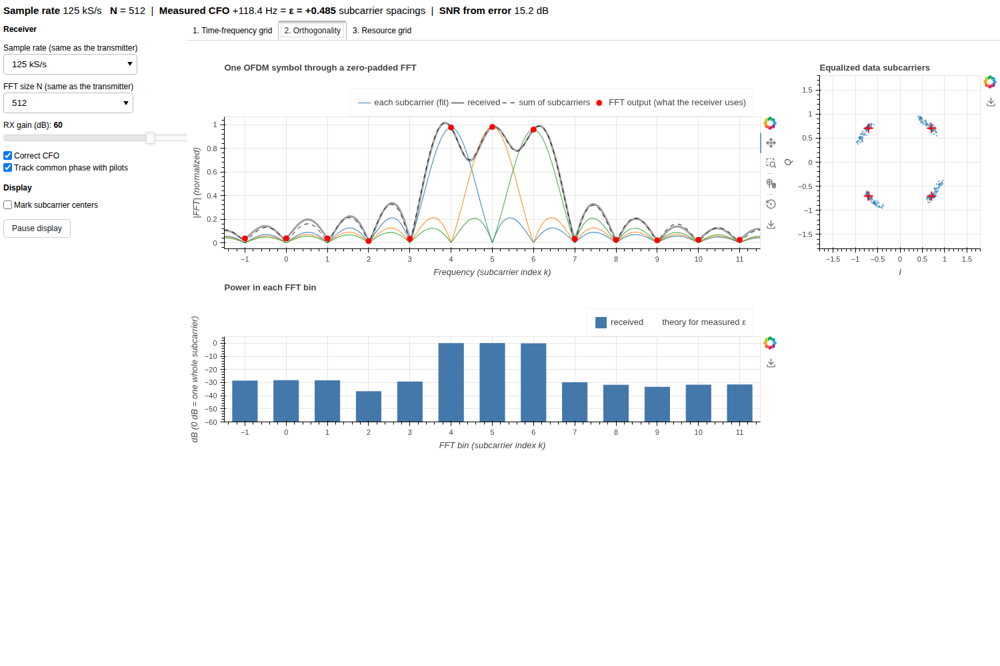

This only works if the red dots are exactly where the subcarriers belong. If the received signal is shifted in frequency, every subcarrier's curve slides sideways, and the red dots no longer land on the zeros of the other subcarriers. How far they slide, measured in subcarriers, is ε = CFO / Δf. So the same offset in Hz makes the curves slide much farther when the subcarriers are close together: 100 Hz is only 0.006 of a subcarrier when they are 15.6 kHz apart, but 0.4 of a subcarrier when they are 244 Hz apart. That is why these screenshots use the closer spacing. In the next screenshots, "Correct CFO" is unchecked, so the receiver leaves the offset in the signal, and the transmitter is tuned to give different values of ε.

With one subcarrier on and ε = 0.26, the hump has slid a quarter of the way toward x = 6. The red dots now land on the sides of the hump and on its ripples, so some of subcarrier 5's power ends up in every other bin: about -10 dB in bin 6, and about -15 dB in bin 4, as the theory predicts. If the other subcarriers were on, this leaked power would interfere with them.

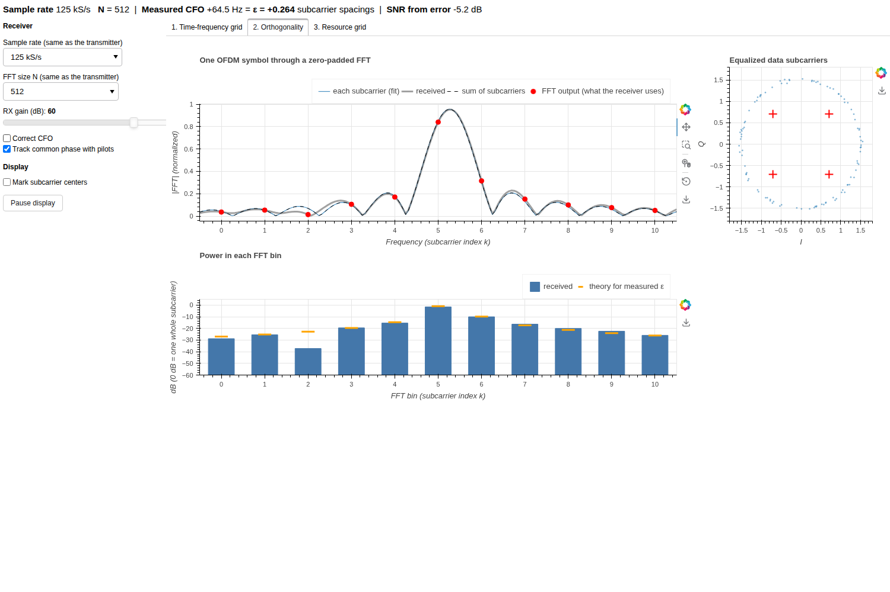

At ε = 0.5, the hump is halfway between bins 5 and 6. Bins 5 and 6 get the same power (about -4 dB each), and the nearby bins get much more than before. This is the worst case.

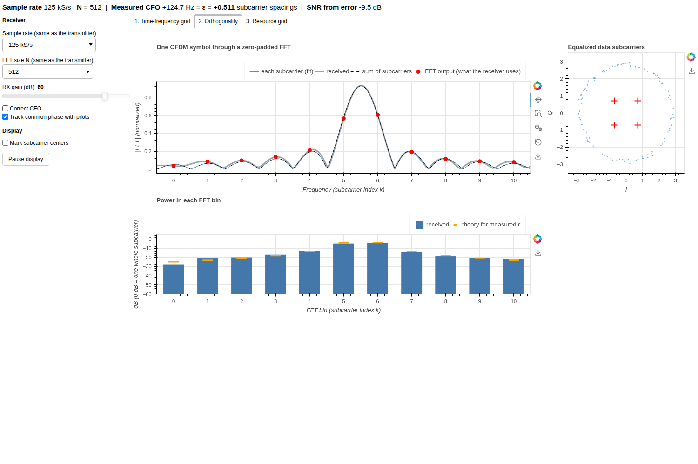

At ε = 1, the hump has moved all the way to x = 6. The red dots are back on the zeros, so the other bins are clean again, but subcarrier 5 is now in bin 6: the receiver would read subcarrier 5's data as if it were subcarrier 6's.

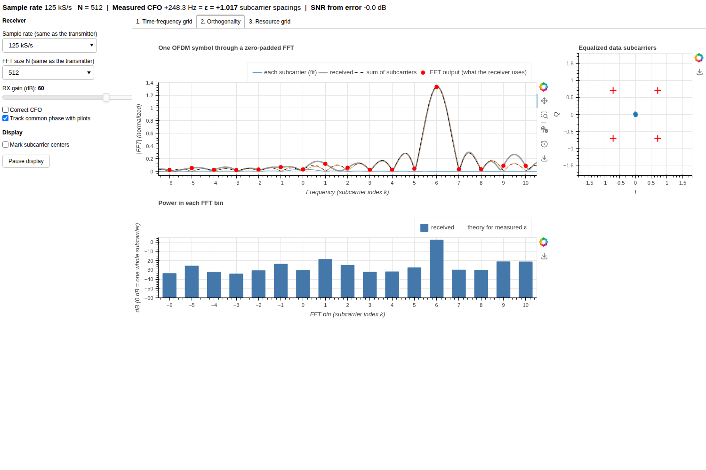

(With only one subcarrier on, ignore the constellation and the SNR. Without CFO correction, and without any pilots on, the symbols slowly turn in a circle during the frame.)

With all the subcarriers on, each bin now picks up leaked power from all its neighbors. This is called inter-carrier interference (ICI), and the constellation shows its effect. At ε ≈ 0, there are four tight clusters and the SNR is about 27 dB: even without CFO correction, nothing goes wrong when there is no offset.

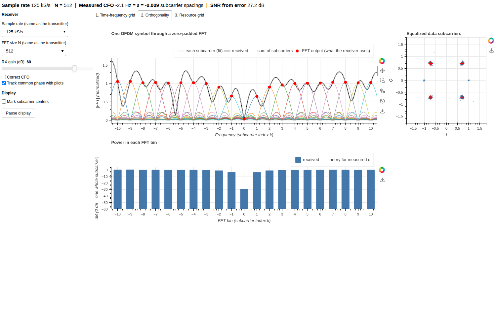

At ε ≈ 0.5, the four clusters have turned into one big cloud (note the scale of the axes), and the SNR is about -15 to -20 dB. Every subcarrier still arrives with plenty of power; the problem is that each FFT bin is now a mix of many subcarriers.

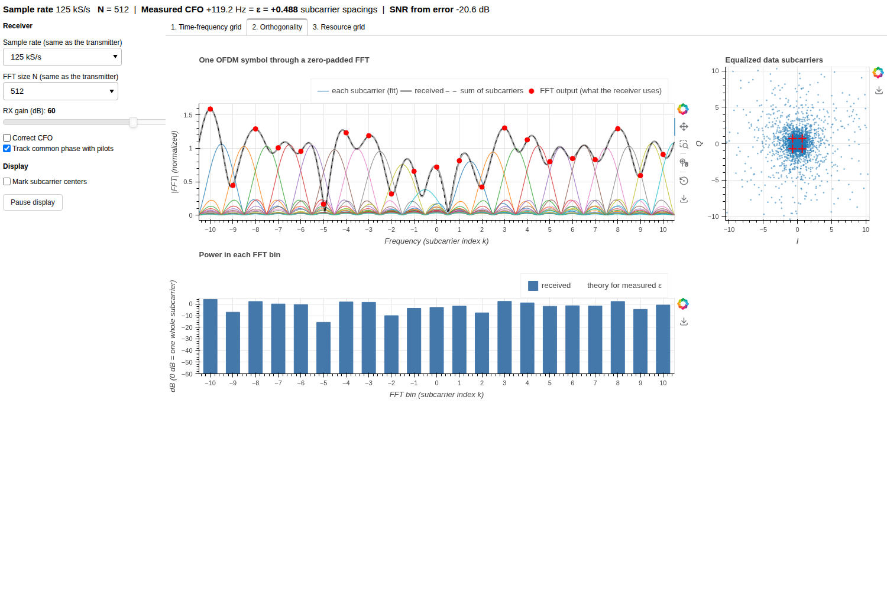

At ε ≈ 1, the clusters look neat again, because the red dots are back on the zeros. But every symbol is now in its neighbor's bin, so most of them are wrong, and the SNR is about -3 dB.

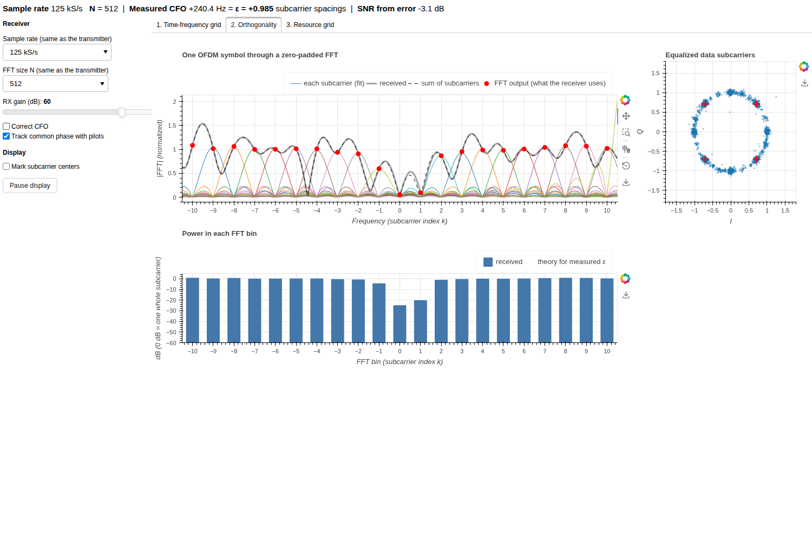

In the third tab, each picture shows one whole frame: across is the subcarrier k (frequency), and up is the OFDM symbol number (time). 

* Each small square is one subcarrier during one OFDM symbol, called a "resource element". 
* The four pictures show what the transmitter sent in each square (as a phase; the data are QPSK, so there are four colors, the dotted lines are the pilots, and the white column is the unused center subcarrier), how strong the received signal is, how much the phase changed between sending and receiving, and how wrong each received symbol is after equalizing (dark is good; bright yellow means the error is as big as the symbol itself). 
* Below them are the channel strength |H[k]| and the error for each subcarrier, averaged over the frame.

At 1 MS/s with N = 64 and the CFO corrected, the received strength is the same everywhere, and |H[k]| changes by less than 1 dB across the band, so the channel treats all subcarriers about the same. The phase change varies smoothly from left to right, because the receiver starts each FFT 2 samples early, and a small time shift looks like a phase that grows steadily with frequency; the equalizer takes it out, so it does no harm. The error is small everywhere, and a little larger right next to the center subcarrier, where the receiver's own leftover signal at 0 Hz leaks in.

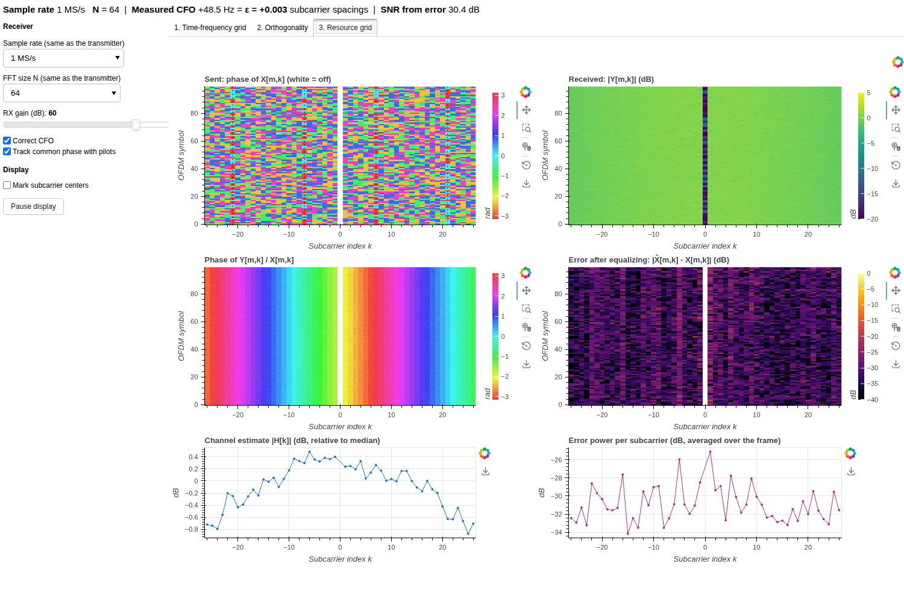

With "Correct CFO" unchecked (but pilot tracking still on) and ε about 0.008, the phase change turns into diagonal stripes: it now also changes steadily from one OFDM symbol to the next. At this subcarrier spacing ε is tiny, so the only effect of the CFO is that all subcarriers rotate together a little in each symbol. The pilots measure that rotation and undo it, so the error stays small.

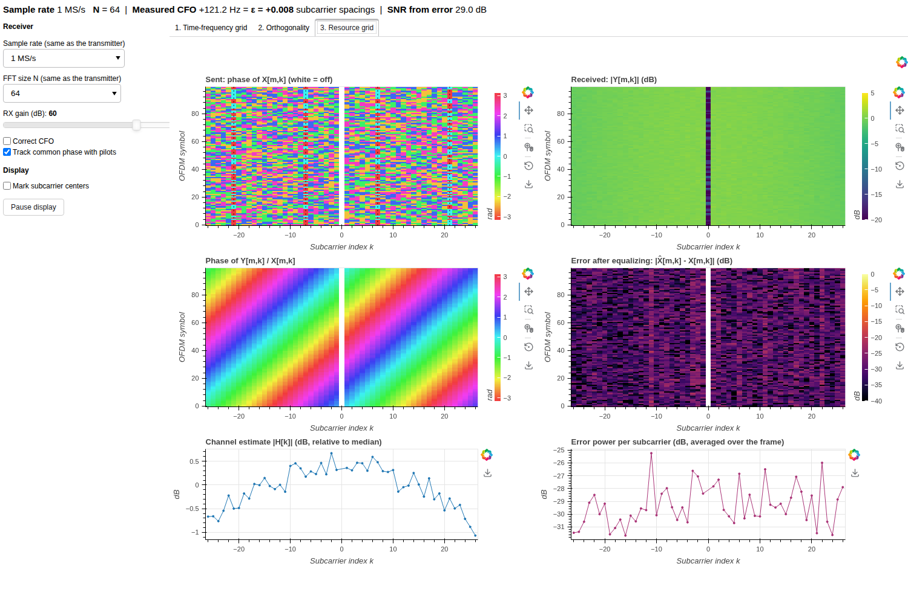

At 125 kS/s with N = 512, the same offset in Hz is ε ≈ 0.5. Without CFO correction, every square is now a mix of neighboring subcarriers. The pilots cannot undo that, because it is not just a rotation, so every picture is noise and the error is large everywhere.

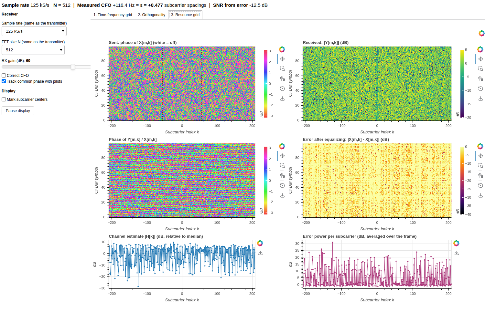

## Run my experiment

### Reserve and image sb5

Create a reservation for `sb5.cosmos-lab.org`. Once the reservation starts, connect to the console:

```bash
# runs on your workstation
ssh -i ~/.ssh/id_ed25519_cosmos YOUR_USERNAME@sb5.cosmos-lab.org
```

Load the Ubuntu 24.04 image on both nodes, turn them on, and wait about one minute for them to boot:

```bash
# runs on the sb5 console
omf load -i ubuntu2404-uhd4.8-gr3.10.ndz -t node1-1,node1-2
omf tell -a on -t node1-1,node1-2
```

Open two more terminals on your workstation and connect to the console in each. In one, connect to the receiver node:

```bash
# runs on the sb5 console
ssh root@node1-1
```

and in the other, connect to the transmitter node:

```bash
# runs on the sb5 console
ssh root@node1-2
```

> [!NOTE]
> If SSH refuses to connect because the "remote host identification has changed", the node was reimaged since you last used it. Remove the old key with `ssh-keygen -R node1-1` (or `node1-2`) on the console and try again.

### Check the B210s

On each node, list the UHD devices:

```bash
# runs on node1-1 and on node1-2
uhd_find_devices
```

The output on each node should include one B210:

```console
--------------------------------------------------
-- UHD Device 0
--------------------------------------------------
Device Address:
    serial: 30D3F15
    name: MyB210
    product: B210
    type: b200
```

### Install the lab software

On both nodes, get the lab scripts:

```bash
# runs on node1-1 and on node1-2
git clone https://github.com/teaching-on-testbeds/ofdm.git /root/ofdm
```

The OFDM scope uses [Bokeh](https://bokeh.org/) to draw plots in your browser. On the receiver node only, install the Python virtual environment tools:

```bash
# runs on node1-1
rm -rf /var/lib/apt/lists/*
apt update
apt -y install python3-venv
```

> [!NOTE]
> `apt update` may warn that it failed to fetch from `repo-i.orbit-lab.org` (a certificate problem on the testbed's own package server). You can ignore that warning, as long as `python3-venv` installs.

Then create a virtual environment that can also use the GNU Radio and UHD packages from the disk image, and install Bokeh in it:

```bash
# runs on node1-1
python3 -m venv --system-site-packages /root/ofdm-venv
/root/ofdm-venv/bin/pip install bokeh==3.10.0
```

### Start the OFDM scope

On the receiver node, start the OFDM scope:

```bash
# runs on node1-1
cd /root/ofdm/src
/root/ofdm-venv/bin/python -m bokeh serve ofdm_scope.py --port 5006 \
  --allow-websocket-origin=localhost:5006 \
  --allow-websocket-origin=127.0.0.1:5006 \
  --args --freq 2400e6
```

Leave it running in this terminal. The output should include `Bokeh app running at: http://localhost:5006/ofdm_scope`.

### Start the transmitter

On the transmitter node, start the transmitter with the default settings (1 MS/s, N = 64, all subcarriers on):

```bash
# runs on node1-2
cd /root/ofdm/src
python3 ofdm_tx.py --freq 2400e6
```

It prints its settings:

```console
TX OFDM at 2400.000000 MHz: fs = 1e+06 S/s, N = 64, subcarrier spacing = 15625.0 Hz, subcarriers on: all, TX gain 85 dB
```

and keeps sending the same OFDM frame over and over until you stop it with `Ctrl+C`. Throughout this experiment, you will stop the transmitter and start it again with different options. These are the options you will use:

| Option | Meaning | Default |
|---|---|---|
| `--samp-rate` | sample rate: `1e6`, `500e3`, `250e3`, or `125e3` | `1e6` |
| `--fft-len` | FFT size N: `64`, `128`, `256`, or `512` | `64` |
| `--subcarriers` | turn on only these subcarriers, e.g. `5`, or `--subcarriers=-26,26` | all on |
| `--every` | turn on only every k-th subcarrier, e.g. `4` | all on |
| `--text` | write this text in the waterfall (up to 12 letters) | |
| `--tx-gain` | TX gain in dB | `85` |
| `--freq` | center frequency in Hz (in Part 2 you will tune it a little off 2400 MHz) | `2400e6` |

Subcarriers that are off are sent as zeros; the preamble always uses all of them.

### Forward the web port

Open another terminal on your workstation. Forward the OFDM scope's port through the sandbox console to `node1-1`:

```bash
# runs on your workstation
ssh -i ~/.ssh/id_ed25519_cosmos -N \
  -L 5006:node1-1.sb5.cosmos-lab.org:5006 \
  YOUR_USERNAME@sb5.cosmos-lab.org
```

Keep this SSH session open. Visit [http://localhost:5006/ofdm_scope](http://localhost:5006/ofdm_scope) in a browser. Open only one browser tab with the scope, since every tab shows (and controls) the same receiver.

The left side of the page has the receiver controls. **The sample rate and FFT size N must match the transmitter's**: whenever you restart the transmitter with a different `--samp-rate` or `--fft-len`, set the same values here. The other controls change how `node1-1` processes what it receives. The line at the top of the page shows the measured CFO and an SNR estimate once the receiver has found an OFDM frame. Use **Pause display** to freeze the plots when you want to take a screenshot.

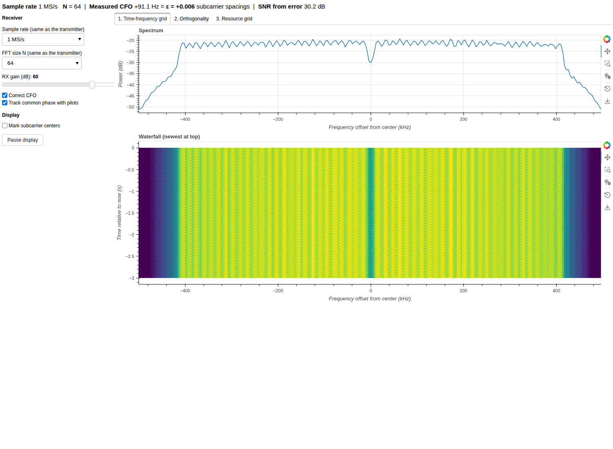

With the default TX gain (85 dB) and RX gain (60 dB), the SNR on sb5 is about 30 dB. Leave them there unless the instructions say otherwise.

### Part 1: OFDM is a time-frequency grid

Open the **1. Time-frequency grid** tab. The top plot is the spectrum of the received signal, and the bottom plot is a waterfall: each row is the spectrum over about 20 ms, with the newest row at the top.

With the transmitter running with the default settings, you should see a flat-topped block of signal, with a notch in the middle.

Now stop the transmitter (`Ctrl+C`) and start it again with only one subcarrier on:

```bash
# runs on node1-2
python3 ofdm_tx.py --subcarriers 5
```

Only one subcarrier is on now: a single tone. Try the same with `--subcarriers=-26,26` (just the two outermost subcarriers), `--subcarriers=-3,-2,-1,1,2,3`, `--every 4`, and `--every 2`. (When the list starts with a minus sign, write it with an `=` as shown, so that it is not mistaken for another option.) In the scope, check "Mark subcarrier centers" to draw a light gray line at each used subcarrier's frequency.

The faint wideband level in the spectrum when only a few subcarriers are on comes from the preamble at the start of every frame, which always uses all the subcarriers.

**Lab report**: Include screenshots of the spectrum with all subcarriers on, with only `-26,26` on, and with every 4th subcarrier on. From the `-26,26` screenshot, estimate the spacing between neighboring subcarriers, and explain how you got it. Compare with Δf = f<sub>s</sub>/N. Estimate the occupied bandwidth with all subcarriers on, and compare it with the number of used subcarriers times Δf.

Next, run the transmitter with all subcarriers on and `--fft-len 128`, then `--fft-len 512`, keeping the sample rate at 1 MS/s. Then run it with N = 64 and `--samp-rate 500e3`, then `--samp-rate 250e3`. Each time, set the same sample rate and N in the scope.

**Lab report**: Fill in a table with the sample rate, N, the subcarrier spacing Δf, the number of used subcarriers, and the occupied bandwidth, for each of the five settings above. What sets the occupied bandwidth of an OFDM signal? What does changing N (at a fixed sample rate) change? Compare with the narrowband signals in the earlier experiments, where the bandwidth was set by the symbol rate.

Now go back to the default settings (1 MS/s, N = 64, all subcarriers on), and look at the middle of the spectrum. Subcarrier k = 0 is never used.

**Lab report**: Zoom in (use the box zoom tool) on the center of the spectrum and include a screenshot. Why might an OFDM system leave the subcarrier at the center frequency empty? (Hint: what else in the receiver ends up at 0 Hz?)

Finally, run the transmitter with a short word, for example:

```bash
# runs on node1-2
python3 ofdm_tx.py --text NYU
```

The transmitter now turns subcarriers on and off over time to spell the word, one row of pixels at a time, and each row lasts many OFDM symbols. Watch it scroll down the waterfall. (Each frame is much longer than usual in this mode, so the other two tabs do not show anything, and the line at the top of the page says the receiver is searching for OFDM frames. That is expected here.)

**Lab report**: Include a screenshot of your word in the waterfall. In a few sentences, explain what each pixel of the picture is, in terms of subcarriers and OFDM symbols.

### Part 2: Overlapping but orthogonal

Open the **2. Orthogonality** tab. In this part, the subcarriers are only 125 kS/s / 512 = 244 Hz apart. With these settings, a frame lasts about half a second, so the plots update more slowly.

**Step 1: see orthogonality.** Run the transmitter with one subcarrier on:

```bash
# runs on node1-2
python3 ofdm_tx.py --samp-rate 125e3 --fft-len 512 --subcarriers 5
```

Set the scope to 125 kS/s and N = 512, and make sure "Correct CFO" and "Track common phase with pilots" are both checked.

**Lab report**: Include a screenshot. Where are the zeros of the subcarrier's spectrum? What is the received power in bins 4 and 6?

Now run the transmitter with `--subcarriers 5,6`, then `--subcarriers 4,5,6`, and then with all subcarriers on (no `--subcarriers` option), keeping `--samp-rate 125e3 --fft-len 512`.

**Lab report**: Include a screenshot with `4,5,6` on. Explain, using the plot, why the FFT output at bin 5 contains only subcarrier 5's symbol, even though subcarriers 4 and 6 overlap it in frequency.

**Step 2: measure the real CFO.** Run the transmitter with all subcarriers on (`--samp-rate 125e3 --fft-len 512`, no `--subcarriers`), keep "Correct CFO" checked, wait a few seconds, and write down the measured CFO in Hz from the top line. Call it C. This is the real offset between the two radios' oscillators.

**Step 3: sweep the offset.** Now uncheck **Correct CFO**, so the receiver no longer removes the offset. You will tune the transmitter so that the total offset gives a chosen value of ε. For a target ε, tune the transmitter to

2400 MHz + (target ε × 244 Hz) − C

For example, if C = +50 Hz and the target is ε = 0.25, that is 2400 MHz + 61 Hz − 50 Hz = 2400 MHz + 11 Hz:

```bash
# runs on node1-2
python3 ofdm_tx.py --freq 2400.000011e6 --samp-rate 125e3 --fft-len 512 --subcarriers 5
```

Do this for target ε = 0, 0.1, 0.25, 0.5, 1, and -0.5. For each target:

1. Run the transmitter with `--subcarriers 5`. Note the measured ε from the top line, and the power in bins 4, 5 and 6 from the bottom plot.
2. Run it again with the same `--freq` but all subcarriers on (no `--subcarriers`). Note the measured ε and the "SNR from error".

The real CFO drifts, so the measured ε will not be exactly your target. That is fine: record the measured value. If it is far off (more than about 0.1), measure C again (with "Correct CFO" checked) and redo that target.

**Lab report**: Make a table with the target ε, the `--freq` you used, the measured ε, the power in bins 4, 5 and 6 (one subcarrier on), and the SNR from error (all subcarriers on). Include screenshots for ε ≈ 0.25, 0.5, and 1, with one subcarrier on, and for ε ≈ 0.5 with all subcarriers on. Then:

- Plot the SNR from error against the measured ε. About how large can ε be before the SNR drops below 10 dB?
- For ε ≈ 0.25 and 0.5, compare the power in bins 4 and 6 with the theory marks.
- Why does the constellation turn into a cloud with all subcarriers on, even though every subcarrier still arrives with the same power as before?
- What happens at ε ≈ 1? Why are the other bins clean again, but the symbols still wrong?
- Compare ε ≈ 0.5 and ε ≈ -0.5. Why do they look alike?

**Step 4: the same offset, different spacings.** Pick one tuning offset: the one for ε = 0.5 above. Keep **Correct CFO** unchecked, keep that `--freq`, and run the transmitter with all subcarriers on at: 1 MS/s with N = 64; 1 MS/s with N = 512; 250 kS/s with N = 512; and 125 kS/s with N = 512. Each time, set the same sample rate and N in the scope, and wait for the numbers to settle.

**Lab report**: Make a table with Δf, the measured CFO in Hz, ε, and the SNR from error, for each setting. The CFO in Hz stays about the same (it only drifts a little): why does its effect depend so much on the subcarrier spacing? What does this suggest about choosing a subcarrier spacing for a real system? (LTE uses 15 kHz. 5G allows 15, 30, 60, 120 kHz and more.)

### Part 3: The resource grid

Open the **3. Resource grid** tab. Run the transmitter with the `--freq` you used for ε = 0.5 in Part 2, and otherwise the default settings (1 MS/s, N = 64, all subcarriers on). Set the scope to match, and check both receiver options again.

Each of the four images is one frame: the horizontal axis is the subcarrier k (frequency), and the vertical axis is the OFDM symbol number m (time, increasing upward, like the waterfall). Each small cell is one "resource element": one subcarrier during one OFDM symbol.

- **Sent: phase of X[m,k]** is what the transmitter put in each cell. The data subcarriers carry QPSK, so there are four colors. The dotted lines mark the pilot subcarriers, and the empty column in the middle is the DC subcarrier.
- **Received: |Y[m,k]|** is the magnitude of the receiver's FFT output in each cell.
- **Phase of Y[m,k] / X[m,k]** is the phase change between what was sent and what was received in each cell.
- **Error after equalizing** is how far each equalized symbol is from what was sent, in dB.

Below them are the channel estimate |H[k]| for each subcarrier (from the preamble) and the error power per subcarrier averaged over the frame.

**Lab report**: Include a screenshot. Is the channel between the two radios frequency-selective (does |H[k]| change much across the band)? The "Phase of Y/X" image changes steadily from left to right across the band. The receiver starts its FFT 2 samples early, inside the cyclic prefix: why does a small timing offset show up as a phase that changes linearly with k, and why does it do no harm here? Which subcarriers have the highest error, and why might that be?

Now uncheck **Correct CFO**, leaving "Track common phase with pilots" checked. Then also uncheck "Track common phase with pilots".

**Lab report**: Include a screenshot of each. How does the "Phase of Y/X" image change when the CFO is not corrected, and why does the pattern change from symbol to symbol (upward) but not much from subcarrier to subcarrier? The pilots let the receiver measure one phase per OFDM symbol, common to all subcarriers. Why is that enough to fix the error here, when ε is small?

Check both options again. Restart the transmitter (with the same `--freq`) with a lower TX gain, `--tx-gain 70`, then `--tx-gain 60`, and watch the error image and the "SNR from error" at the top.

**Lab report**: Include a screenshot of the error image at a TX gain of 60 dB, and note the SNR at each gain. Is the extra error spread evenly over the grid?

Finally, restart the transmitter with the same `--freq`, the default TX gain, and `--samp-rate 125e3 --fft-len 512`, set the scope to match, and uncheck **Correct CFO** again (leave pilot tracking on).

**Lab report**: Include a screenshot. Compare it with the N = 64 case without CFO correction. Why can the pilots not fix the error this time?

### Stop the experiment

Stop the transmitter and the OFDM scope with `Ctrl+C` in their terminals, and press `Ctrl+C` in the workstation terminal that runs the SSH port forwarding. The next `omf load` will replace the nodes' disk contents, so copy any results you want to keep before your reservation ends.
